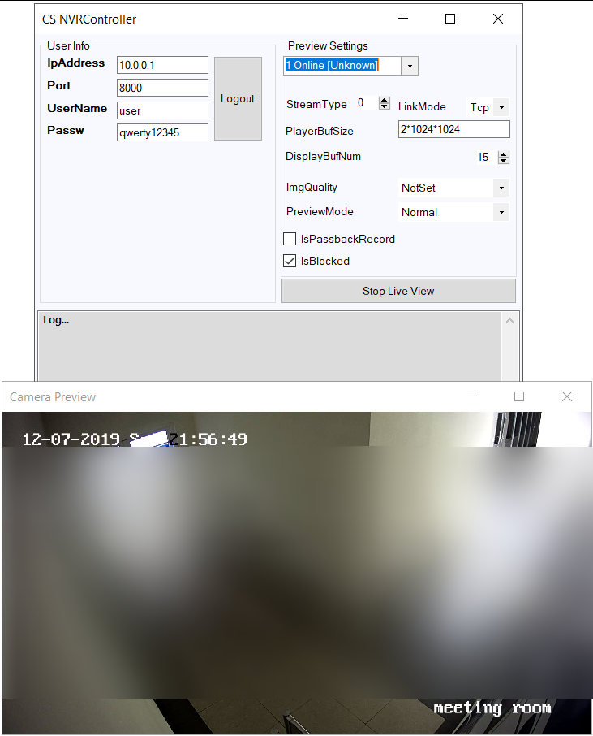
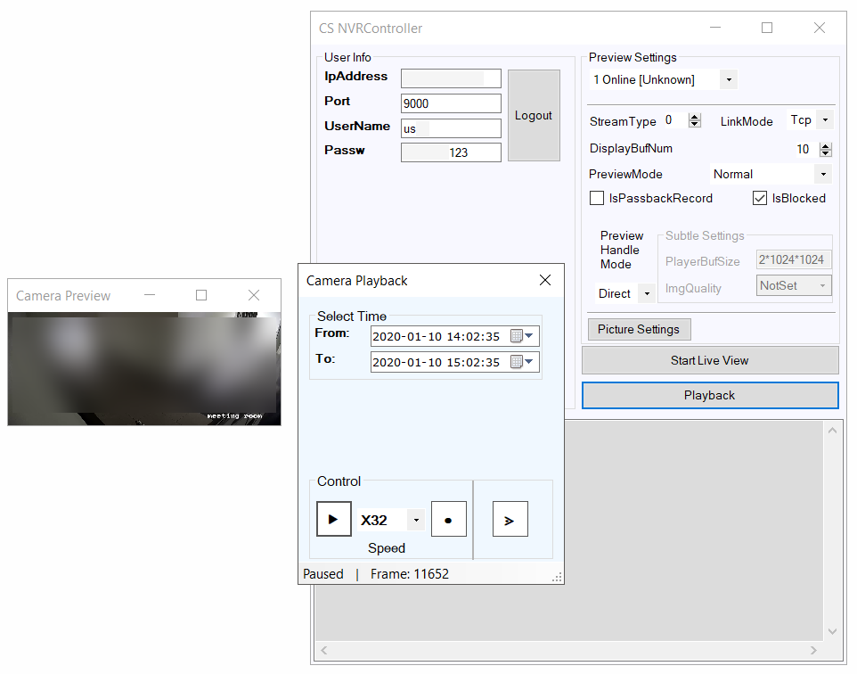
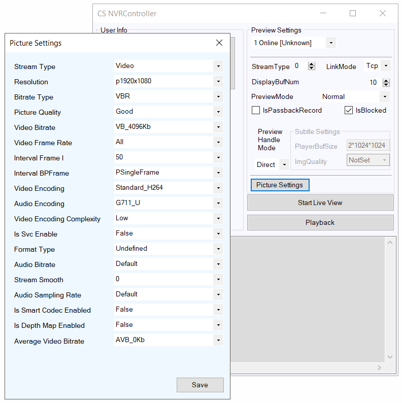

# CS_NvrControllerLib
C# libruary, that allows control NVR Device with IP Camera connected to it.
Minimal .NET Framework 4.5

# CS_NvrControllerGUI
Example of using CS_NvrControllerLib libruary.
Minimal .NET Framework 7.1

